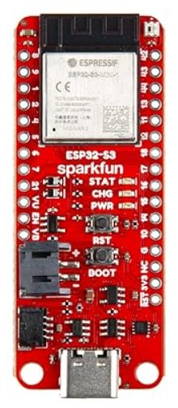
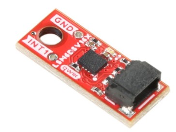

# LSM6DSV16X IMU Interface with ESP-IDF

This project demonstrates interfacing the **LSM6DSV16X IMU** (Accelerometer + Gyroscope) with an ESP32 using **I2C** and ESP-IDF.

### Hardware components

<table align="center">
<tr>
<td align="center" style="padding-right:40px;">
<br>
ESP32-S3
</td>

<td align="center">
<br>
LSM6DSV16X IMU Sensor
</td>
</tr>
</table>

- ESP32S3 Development Board: https://www.amazon.in/SparkFun-WRL-24408-Thing-Plus-ESP32-S3/dp/B0D1BB79SM
- LSM6DSV16X IMU sensor module: https://evelta.com/sparkfun-micro-6dof-imu-breakout-lsm6dsv16x/
- qwiic cable: https://amzn.in/d/0cWzXpmK


## Features

- I2C communication setup (400 kHz fast mode)
- Automatic device detection (0x6A / 0x6B)
- WHO_AM_I verification (0x70)
- Sensor initialization:
  - Accelerometer: ±2g, 120 Hz
  - Gyroscope: ±250 dps, 120 Hz
- Burst read for efficient data acquisition
- Conversion to:
  - m/s² (acceleration)
  - dps (angular velocity)


## How It Works

### 1. I2C Setup
- Configures ESP32 as I2C master
- Scans bus for connected devices

### 2. Sensor Detection
- Reads `WHO_AM_I` register
- Confirms LSM6DSV16X (expected: `0x70`)

### 3. Initialization
- Software reset
- Enables:
  - Block Data Update (BDU)
  - Auto-increment (IF_INC)
- Configures ODR = 120 Hz for both accel & gyro

### 4. Data Acquisition
- Polls `STATUS_REG`
- Performs **12-byte burst read**
- Extracts:
  - Gyroscope (X, Y, Z)
  - Accelerometer (X, Y, Z)

### 5. Unit Conversion
- Raw → mg/mdps → g/dps → m/s²


## Hardware Used

- ESP32S3 (ESP-IDF)
- LSM6DSV16X IMU (STMicroelectronics)


## Pin Configuration

| Signal | ESP32 Pin |
|--------|----------|
| SDA    | GPIO 8   |
| SCL    | GPIO 9   |


## How to Run

```bash
idf.py build
idf.py -p COMx flash monitor
```


## Notes

- Ensure pull-up resistors on SDA & SCL
- Check correct I2C address (0x6A or 0x6B)
- Sensor must respond with WHO_AM_I = 0x70

### VS code problems with their solutions

#### 1. idf.py not recognized

Cause: Environment not loaded

Fix:
```
& 'C:\Espressif\tools\Microsoft.v6.0.PowerShell_profile.ps1'
```
#### 2. 'C:\Users\Shraddha' not recognized

Cause: Space in username breaks export.bat

Fix:
Do not use export.bat
Use ESP-IDF PowerShell environment instead:
```
& 'C:\Espressif\tools\Microsoft.v6.0.PowerShell_profile.ps1'
```
#### 3. VS Code ESP-IDF terminal not working

Cause: Extension not configured or environment not loaded

Fix:
Reinstall ESP-IDF extension
Or manually load environment:
```
& 'C:\Espressif\tools\Microsoft.v6.0.PowerShell_profile.ps1'
```
#### 4. CMakeLists.txt not found
   
Cause: Running command in wrong directory

Fix:
```
cd your_project_folder
idf.py build
```
#### 5. Wrong chip argument (ESP32 vs ESP32-S3)

Cause: Target mismatch

Fix:
```
idf.py set-target esp32s3
```
#### 6. set-target not consistent with environment

Cause: Environment variable overriding target

Fix:
```
Remove-Item Env:IDF_TARGET
idf.py set-target esp32s3
```
#### 7. Target not changing even after fullclean

Cause: sdkconfig still contains old target

Fix:
Delete:
```
sdkconfig
sdkconfig.old
```
Then:
```
idf.py set-target esp32s3
```
#### 8. Build works but flash fails

Cause: Target mismatch or incorrect port

Fix:
```
idf.py -p COM7 flash
```
Also verify correct target is set.

#### 9. Multiple ESP-IDF installations causing confusion

Cause: Duplicate environments

Fix:
Keep:
```
C:\Espressif\tools
C:\esp_idf
```
Remove:
```
C:\Users\...\ .espressif
```
#### 10. Recommended workflow

Always start with:
```
& 'C:\Espressif\tools\Microsoft.v6.0.PowerShell_profile.ps1'
cd your_project
idf.py build
idf.py flash monitor
```
Quick checklist
Verify current directory:
```
pwd
```
Verify target:
```
idf.py set-target esp32s3
```
Verify environment is loaded before running commands
Check version:
```
idf.py --version
```
This should cover most common ESP-IDF setup and build issues.
